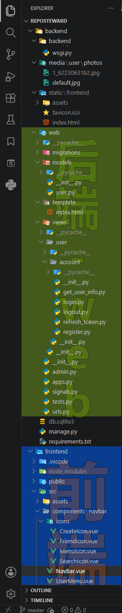
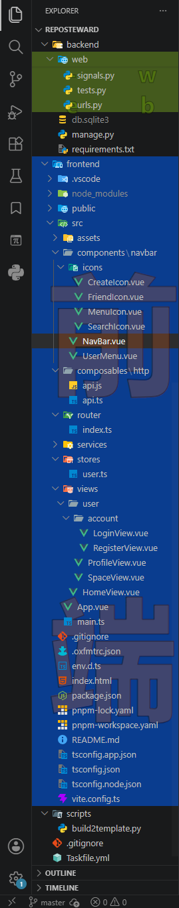
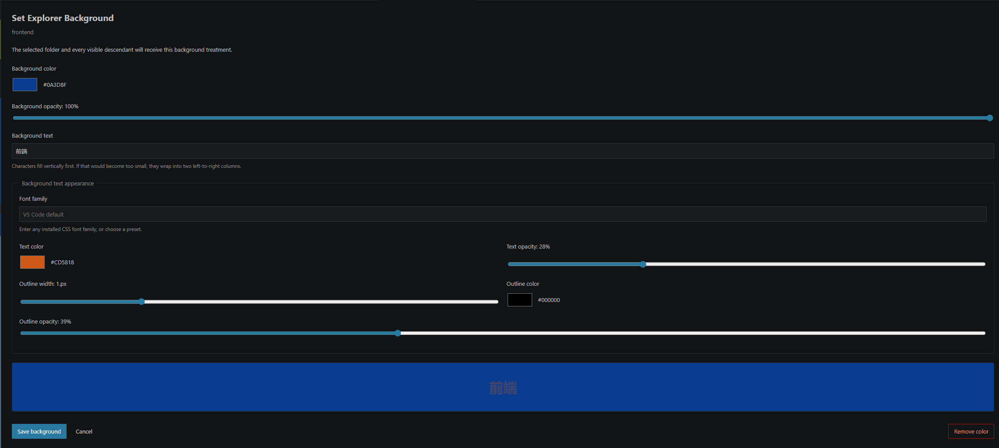

# 彩色文件夹背景

为 VS Code 内置资源管理器中的本地文件和文件夹添加可配置的背景色、透明度与文字水印。

它直接作用于内置 Explorer，而不是另建一个文件树：在文件或文件夹上右键即可配置；文件夹规则会应用到可见后代，嵌套规则由路径更深的配置覆盖。

> 注意：此扩展使用 `be5invis.vscode-custom-css` 向 VS Code 工作台注入本地运行时。该方式并非 VS Code 公开扩展 API，可能触发工作台完整性提示，并且 VS Code 更新后需要重新应用注入。

## 实际效果

### Explorer 区域背景与水印

<table>
  <tr>
    <td width="50%" align="center">
      
      <br />
      <sub>递归文件夹背景与文字水印</sub>
    </td>
    <td width="50%" align="center">
      
      <br />
      <sub>嵌套目录规则与独立区域配色</sub>
    </td>
  </tr>
</table>

### 背景编辑器



## 功能

- 在 Explorer 的本地文件或文件夹右键菜单中设置、移除背景色。
- 文件夹规则递归覆盖可见后代；更深层的嵌套规则优先。
- 独立设置背景颜色与不透明度。
- 为一个区域设置背景水印文字；单列竖排空间不足时自动转为两列布局。
- 为水印配置字体家族、文字颜色/透明度、描边颜色/透明度与描边宽度。
- 设置页面默认中文，并可在右上角即时切换到 English；切换语言不会丢失未保存的编辑内容。
- 保持 Explorer 的点击、悬停、选中和焦点反馈；水印层不会接收鼠标事件。

## 安装

### 从 VS Code Marketplace 安装

在扩展视图中搜索 **彩色文件夹背景**，或运行：

```powershell
code --install-extension lingyenbird.colored-folder-background
```

Marketplace 页面：<https://marketplace.visualstudio.com/items?itemName=lingyenbird.colored-folder-background>

### 从 VSIX 安装

```powershell
code --install-extension .\colored-folder-background-<version>.vsix
```

扩展依赖 [Custom CSS and JS Loader](https://marketplace.visualstudio.com/items?itemName=be5invis.vscode-custom-css)。如果工作台修改被权限拦截，请以管理员身份启动 VS Code，并按该加载器的提示重新加载窗口。

## 快速开始

1. 在 Explorer 中右键本地文件或文件夹。
2. 选择 **彩色文件夹背景：设置背景颜色**。
3. 设置颜色、背景不透明度和可选的背景文字。
4. 如需文字水印，继续设置字体、文字色、透明度和描边。
5. 点击 **保存背景**；Custom CSS and JS Loader 提示时重新加载 VS Code。

选中文件夹时，规则会应用到该文件夹和所有可见后代。若父子路径都已配置，路径更深的规则优先。

## 水印布局

水印不会遮挡文件操作：它位于 Explorer 内容之后，且 `pointer-events` 已关闭。

- 单个字符会尽可能填满区域。
- 多字符默认按竖排单列布局。
- 当单列字体会过小时，自动改为两列，并按从左到右、从上到下排列。
- 可用空间不足以保证最小可读字体时，不渲染水印。

## 命令

| 命令 | 用途 |
| --- | --- |
| `彩色文件夹背景：设置背景颜色` | 为选中的本地文件或文件夹创建或更新规则。 |
| `彩色文件夹背景：移除背景颜色` | 移除选中资源的规则。 |
| `彩色文件夹背景：应用 Explorer 背景颜色` | 重新写入注入运行时并请求加载器刷新。VS Code 更新后可使用。 |
| `彩色文件夹背景：禁用 Explorer 背景注入` | 移除本扩展管理的加载器导入，保留已保存规则。 |
| `彩色文件夹背景：清除所有背景颜色` | 清除当前工作区中的全部规则。 |

## 兼容性与限制

- 需要 VS Code `^1.130.0`。
- 仅支持 `file` 方案的本地 Explorer 资源。
- 不使用 VS Code 公开 API 能力之外的 Explorer 样式接口；实现依赖内置 DOM 结构，因此可能随 VS Code 更新变化。
- VS Code 更新可能覆盖 Custom CSS and JS Loader 的工作台修改；更新后运行 **应用 Explorer 背景颜色** 并接受加载器的重新应用提示。
- 这是针对桌面工作台的 UI 扩展，不能在浏览器版 VS Code 中使用。

## 数据与隐私

- 区域规则保存在 VS Code 的工作区状态中，不会写入项目文件。
- 注入运行时写入扩展的全局存储目录，并通过 Custom CSS and JS Loader 的 `vscode_custom_css.imports` 设置引用。
- 本扩展自身不发送 Explorer 路径、规则或水印文本到网络。

## 开发

```powershell
pnpm install
pnpm run compile
pnpm run package
```

## 许可证

本项目采用 [GNU Affero General Public License v3.0](LICENSE) 授权。


## 推广

学代码，上L站
https://linux.do
